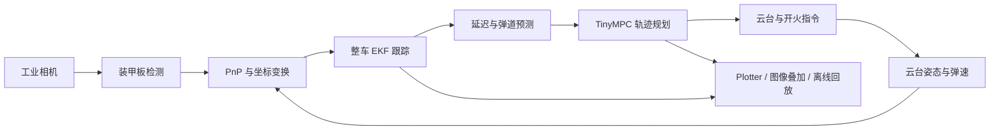

# sp_vision_25-main-plus

基于同济大学 SuperPower 战队 25 赛季视觉框架继续开发的 RoboMaster 自瞄工程。项目保留了原版无强制 ROS 依赖、模块化 C++ 实现和完整硬件链路，并针对目标关联、EKF 诊断、PnP 位姿选择、旋转目标规划、MPC 调试与离线复现等进行了增改。

本仓库对应的初始版本，也是26赛季鸿龙战队使用的自瞄代码保存在步兵NUC：

```text
自瞄代码/sp_vision_25-main（26赛季比赛版）
```
# 前言
   2026赛季鸿龙战队自瞄由同济版沿用修改，虽然在步兵对抗赛和3V3取得成绩不错，但仍旧存在许多问题，例如：云台yaw在近距离瞄准小陀螺时会出现过冲的现象,极限距离静止靶与小陀螺（高/远）打击效果欠佳（命中率30%以下），T/R矩阵标定有误导致重投影偏差过大等，针对这些问题笔者进行了整改，通过限制出板进板角度，增加目标关联的uv观测，新增矩阵重建标定文件以及优化原有的一些传输逻辑，减小了这些问题的影响。
   通过多次测试，当前同一参数，静止靶与平移靶在3m内命中率可达95%以上（散步稳定），0.67转每秒（4.2rad/s）的旋转不平移小陀螺2m命中率可达70%以上，1转每秒（6.3rad每秒）的旋转平移小陀螺2-3米命中率可达60%以上，针对实战而言，命中率可能因为本身位移,地方单位急停等原因有所下降，但总体相较去年提升显著。
   但这不意味着已经十分完美，当前项目仍存在以下可改进方向，如同步多个时间戳（除了软件层面，还有硬件层面），引入车辆自生的运动模型对预瞄点进行补偿，实现边走边打等等（详见第八点），后续需要新队员逐步进行改进。
## 1. 项目基础功能

本项目负责 RoboMaster 机器人视觉自瞄侧的完整流程：

1. 从工业相机获取图像，并按图像时间查询对应的云台姿态。
2. 使用传统方法和OpenVINO YOLO 模型检测装甲板。
3. 通过 PnP、坐标变换和重投影优化估计装甲板三维位姿。
4. 使用扩展卡尔曼滤波器估计整车中心、平移速度、旋转角速度、装甲板半径和高度差。
5. 根据目标状态、系统延迟与弹道飞行时间预测未来位置。
6. 使用普通瞄准器或 TinyMPC （当前使用）轨迹规划器生成云台角度、角速度、角加速度和开火指令。
7. 通过串口和 CAN 与下位机通信，并提供录制、绘图、离线回放和标定工具。


## 2. 数据流与目录



主要目录如下：

```text
assets/                  模型和演示数据
calibration/             相机、手眼与重投影标定工具
configs/                 不同机器人和调试场景的 YAML 配置
io/                      相机、云台、串口和 CAN 设备接口
src/                     各兵种与调试程序入口
tasks/auto_aim/          检测、解算、跟踪、瞄准与 MPC 规划
tasks/auto_buff/         能量机关相关功能
tests/                   单模块测试和离线回放程序
tools/                   EKF、弹道、录制、日志、绘图等通用工具
```

## 3. 相对初版的主要改进

### 3.1 目标关联与状态估计

- **马氏距离关联门控**：装甲板匹配由“距离最近的若干块装甲板再比较角度”改为基于预测协方差和观测噪声的马氏距离选择，并可通过 `gate_threshold` 等参数拒绝离群观测。
- **修正 EKF 统计量计算**：NIS 使用先验新息与先验新息协方差，NEES 使用状态修正量与先验协方差，避免将更新后的残差和协方差错误用于一致性检验。
- **静止旋转目标模式**：可降低静止小陀螺中心过程噪声，并在采样收敛后锁定中心，减少未观测装甲板随中心噪声摆动。该模式主要用于在旋转不平移靶车调制合适的延迟时间，实战需要关闭。

当前 `Target` 中还实现了基于四角点像素残差的重投影观测函数和数值雅可比，但主更新路径仍使用 `yaw/pitch/distance/angle` 观测，因此它属于实验性能力，尚未完整接入正式跟踪流程。

### 3.2 PnP 与位姿解算

- 使用 `solvePnPGeneric(..., SOLVEPNP_IPPE)` 同时获取平面装甲板的候选位姿。
- 剔除位于相机后方或不满足当前法向几何约束的候选解。
- 在有效候选中选择四角点重投影误差最小的解；几何约束全部失败时，记录警告并退回最小重投影误差解。
- 新增 `reprojection_calibrator` 构建目标，用于重投影相关标定与误差检查，主要用于修改R_camera2gimbal标定不准确的问题，t_camera2gimbal通过实际测得。

### 3.3 旋转目标与 MPC 规划

- **旋向对称的速度判断**：延迟档位和旋转状态统一使用角速度绝对值，修复负方向高速旋转被误判为低速的问题。
- **连续权重选板**：规划器综合当前锁定板、装甲板朝向、旋转方向和角速度选择目标装甲板，降低硬阈值切换造成的抖动。
- **离去板抑制**：根据角速度符号增加离去方向代价，优先选择正面的装甲板和即将远离的装甲板。
- **高速中心收缩**：目标转速升高时，瞄准点按连续权重由装甲板中心向整车旋转中心收缩，限制枪口摆幅，转速越快，越稳定。
- **可射击角门控**：除 MPC 轨迹误差阈值外，还检查目标装甲板相对正面的夹角，减少追打侧面板或离去板。
- **不可解弹道保护**：弹道构造失败时直接放弃该帧规划，且 `Trajectory` 的飞行时间和俯仰角具有安全默认值。
- **显式规划时刻**：规划接口可接收调用方时间点，离线回放能够使用视频时间而不是墙钟时间，避免预测时间差异常。

MPC 仍采用 yaw、pitch 两个独立的一维二阶模型，默认控制周期为 `0.01 s`，规划长度为 100 个采样点，输出中间时刻的角度、角速度和角加速度作为控制指令。

### 3.4 调试、录制与离线复现

- `auto_aim_debug_mpc` 新增 `--record` 参数，可同步保存图像、姿态和时间信息。
- 规划线程与显示线程之间的最新 `Plan` 使用互斥锁保护，避免调试可视化读取到竞争状态。
- 实时画面区分三类结果：绿色为 EKF 预测装甲板，红色为 MPC 前选定的目标装甲板，青色十字为 MPC 输出指令对应的视线方向。
- 新增 `auto_aim_mpc_test`，可使用录制的 `.avi + .txt` 数据进行离线检测、跟踪和规划回放，也可在无图形环境下运行。
- 删除规划主循环中的高频标准输出，降低实时线程中的无效 I/O 干扰。

## 4. 环境与依赖

原项目验证环境为 Ubuntu 22.04，主要依赖包括：

- CMake、支持 C++17 的编译器
- OpenCV
- Eigen3
- yaml-cpp
- fmt、spdlog
- nlohmann-json
- OpenVINO 2024
- MindVision SDK 或 HikRobot MVS SDK
- Ceres Solver（标定工具使用）
- TinyMPC（源码已包含在工程构建链路中）

可通过 apt 安装基础依赖：

```bash
sudo apt update
sudo apt install -y \
  git g++ cmake can-utils \
  libopencv-dev libfmt-dev libeigen3-dev libspdlog-dev \
  libyaml-cpp-dev libusb-1.0-0-dev nlohmann-json3-dev \
  libceres-dev openssh-server screen
```

工业相机 SDK 和 OpenVINO 需按对应厂商文档单独安装。当前根 `CMakeLists.txt` 中的 `OpenVINO_DIR` 指向 `/opt/intel/openvino_2024.6.0/runtime/cmake/`；若安装位置或版本不同，请修改该路径或在配置 CMake 时传入正确位置。

## 5. 编译

```bash
cmake -B build
make -C build/ -j`nproc`
```

常用构建目标：

| 目标 | 用途 |
| --- | --- |
| `standard` | 标准机器人主程序 |
| `standard_mpc` | 使用 MPC 规划器的标准机器人程序 |
| `auto_aim_debug_mpc` | MPC 实机调试、可视化和录制 |
| `auto_aim_mpc_test` | 录制数据离线回放 |
| `auto_buff_debug_mpc` | 能量机关 MPC 调试 |
| `reprojection_calibrator` | 重投影标定工具 |
| `camera_test` / `gimbal_test` | 硬件链路测试 |


## 6. 运行与调试

### 6.1 实机 MPC 调试

```bash
./build/auto_aim_debug_mpc configs/standard3.yaml
```

启用录制：

```bash
./build/auto_aim_debug_mpc configs/standard3.yaml --record=true
```

运行前应确认：

- 配置中的相机名称、内参、畸变和相机到云台外参正确。
- `enemy_color` 与比赛方颜色一致。
- 串口或 CAN 设备存在且当前用户具有访问权限。
- `bullet_speed` 能从下位机正常更新；异常低值会触发代码中的回退逻辑。


### 6.2 离线 MPC 回放

输入基路径对应同名的 `.avi` 和 `.txt` 文件，例如：

```text
assets/demo/demo.avi
assets/demo/demo.txt
```

带窗口回放：

```bash
./build/auto_aim_mpc_test records/2026-09-12_14-49-25
```

无显示环境运行：

```bash
./build/auto_aim_mpc_test records/2026-09-12_14-49-25 \
  --config-path=configs/demo_mpc.yaml --view=0
```

离线程序使用录制时间构造 `steady_clock` 时间点，并将同一帧时间显式传入 Tracker 和 Planner，以保证回放预测步长与真实视频一致。

### 6.3 自动启动

仓库中的 `vision.sh` 当前包含本机绝对路径。部署到其他设备前需要修改工作目录，再授予执行权限：

```bash
chmod +x vision.sh
```
启动脚本默认运行 `auto_aim_debug_mpc`，并通过 `configs/standard3.yaml` 加载配置。确认脚本中的工作目录、配置文件和设备名均与当前机器人一致后再启用自启动。

## 7. 从标定到实车调试

建议严格按照“硬件自检 → 标定 → 离线验证 → 低风险实车调试”的顺序推进。每一步先保存产物和日志，再进入下一步；不要在标定、跟踪和 MPC 参数同时变化时判断问题原因。

### 7.1 调试前准备

1. 确认相机 SDK、串口或 CAN 驱动、OpenVINO 和模型文件已经安装。
2. 赋予当前用户有串口权限；临时测试可以执行：

    ```bash
    chmod 666 /dev/ttyACM*
    ```
3. 检查 YAML 中的 `camera_name`、`com_port`、`can_interface`、`enemy_color` 和模型路径。

### 7.2 采集相机标定数据>l

当前采集程序默认使用 `configs/calibration.yaml`，检测 11×8 内角点棋盘格。将标定板放在相机视野内，覆盖近、中、远距离以及图像四角和中心，改变棋盘格的俯仰、偏航和距离，采集 30 至 40 张清晰且互不重复的图像。

```bash
./build/capture \
   --config-path=configs/calibration.yaml \
   --output-folder=assets/img_with_q
```

窗口中按 `s` 保存当前图像和对应姿态，按 `q` 退出。每张图会生成同编号的 `.jpg` 和 `.txt` 文件；不要手动打乱配对关系。采集前应确认棋盘格内角点数量、方格尺寸和 [configs/calibration.yaml](configs/calibration.yaml) 一致。

### 7.3 标定相机内参
1. 云台可固定，棋盘格动。
2. 棋盘格应覆盖画面中心、四角和四条边，尤其不要只在中心拍。
3. 改变与相机的距离，让棋盘格在画面中有大有小。
4. 让棋盘格向上下、左右倾斜，避免全部正对相机。
5. 棋盘格尽量占画面的 30%～80%，太小会降低角点精度。
6. 使用与采集数据一致的棋盘格配置运行内参标定：

```bash
./build/calibrate_camera \
   --config-path=configs/calibration.yaml \
   assets/img_with_q
```

程序会逐张显示角点检测结果，并在终端输出 `camera_matrix`、`distort_coeffs` 和重投影误差。将结果写入对应车型 YAML，不要直接覆盖全部配置。建议把标定日期、相机序列号、分辨率和重投影误差写在 YAML 注释中。内参矩阵确定后，一定要固定好，确保焦距不会变化，否则需要重新标定。

验收标准：角点应覆盖完整图像区域，重投影误差应稳定且没有少数图片明显偏大。若角点检测失败，先改善光照、对焦和棋盘格姿态。

### 7.4 设置相机到云台的外参
1. 先把 calibrate_camera 得到的 camera_matrix 和 distort_coeffs 写入 calibration.yaml。
2. 棋盘必须固定，云台动。棋盘格必须固定不动，整个采集过程中不能移动标定板。
3. 相机必须牢固安装在云台上，采集过程中不能改变相机与云台的相对位置。
4. 云台停稳后再保存图像和姿态，避免相机曝光时刻与四元数时刻错位。
5. yaw 至少覆盖约 ±30∘；pitch 至少覆盖约 ±15∘或更大；
6. 不要只绕单一轴旋转。每个姿态之间要有明显差异，不要连续保存大量几乎相同的照片。
7. 盘格仍需完整可见，并尽量占画面的 30%～70%。
8. 不要移动底盘,若底盘或标定板移动，固定世界坐标系的假设就会失效。
```bash
./build/calibrate_handeye
```
外参至少包括旋转矩阵 `R_camera2gimbal` 和平移向量 `t_camera2gimbal`。当前工程中的 `calibrate_handeye.cpp`实际部署时应使用经过验证的标定结果，用尺测量相机光心到云台旋转中心的平移初值（t_camera2gimbal），单位为米。两者差异很大时，不要直接采用标定值。

将外参写入车型 YAML 后，使用录制数据运行交互式重投影检查：

```bash
./build/reprojection_calibrator \
   --config-path=configs/demo_mpc.yaml \
   records/2026-09-15_09-59-23
```

程序中：

- `a` / `d`：绕 Z 轴旋转 ±0.1°；
- `w` / `s`：绕 Y 轴旋转 ±0.1°；
- `q` / `e`：绕 X 轴旋转 ±0.1°；
- `u` / `j`、`h` / `k`、`n` / `m`：沿 X、Y、Z 平移 ±1 mm；
- `p`：打印当前 `R_camera2gimbal` 和 `t_camera2gimbal`；
- 空格：处理下一帧，`Esc` 或 `x`：退出。

调整目标是让绿色模型投影与检测到的装甲板保持一致，并在多帧、多姿态下都稳定。按 `p` 打印的结果需要人工写回配置文件；不能只凭单帧对齐判断外参正确。若重投影结果随云台运动系统性偏移，应优先检查坐标系方向、四元数时间对齐和 `R_gimbal2imubody`，不要先调跟踪器。

### 7.5 离线验证算法链路

完成内外参后，可用录制数据验证检测、PnP、跟踪、预测和 MPC，避免直接在实车上同时排查多个环节或者等待机械装配/等待电控调试/等待电池充电等等。输入路径必须同时存在同名的 `.avi` 和 `.txt` 文件：

```bash
./build/auto_aim_mpc_test \
   --config-path=configs/demo_mpc.yaml \
   records/2026-09-15_09-59-23 \
   --view=0
```

建议按以下顺序检查：

1. 检测框和四角点是否稳定，颜色和装甲板类别是否正确。
2. 可用plotjuggler观察PnP 解算距离、yaw、pitch 是否连续，是否出现明显跳变或负深度。
3. EKF 是否能从临时目标进入正式跟踪，门控拒绝次数是否异常。
4. 旋转目标的角速度、选板和预测轨迹是否合理，MPC 输出是否为有限值。
5. 记录异常帧的时间戳、配置和日志，确保修改后可以复现同一段数据。

### 7.6 低风险实车调试顺序

2. **静止靶**：检查内参、外参、距离和瞄准偏置。此阶段只调整R矩阵， `yaw_offset`、`pitch_offset` （范围应小于1）
3. **平移靶**：观察目标中心速度、关联门控和预测延迟。
4. **低速旋转靶**：检查选板连续性、`low_speed_delay_time`、`leaving_angle` 和开火门控`fire_thresh`。
5. **高速旋转靶**：最后可以调整 `spin_speed_scale`、`min_aim_radius_ratio`、`high_speed_delay_time` 。记录命中率时同时记录射频、距离、转速和目标是否平移。
6. **正式发弹**：需先单发或低射频验证，确认弹速可信、云台反馈有效、目标数据未过期且开火条件连续满足，再进行连续射击。

每次只改变一组同类参数，并保留配置副本。推荐的诊断顺序是“检测 → PnP/标定 → EKF/关联 → 预测/弹道 → MPC → 下位机控制”，前一级异常时不要用后一级参数补偿。

## 8. 关键配置参数

不同机器人应使用独立 YAML 文件，避免将标定值和动力学参数跨车复制。

### 跟踪与关联

| 参数 | 含义 |
| --- | --- |
| `min_detect_count` | 临时目标转为正式目标所需连续检测次数 |
| `max_temp_lost_count` | 普通目标允许的临时丢失帧数 |
| `armor_radius` | 装甲板中心到车辆旋转中心的初始半径 |
| `armor_height_diff` | 相邻装甲板高度差初值 |
| `gate_threshold` | 马氏距离门控阈值，越小越严格 |
| `gate_yaw_noise` / `gate_pitch_noise` | 关联时 yaw/pitch 观测噪声方差 |
| `gate_distance_noise_ratio` | 距离观测标准差与距离的比例 |
| `gate_angle_noise` | 装甲板朝向观测噪声方差 |
| `stationary_target` | 是否启用静止旋转目标模型 |
| `lock_stationary_center` | 收敛后是否锁定静止目标中心 |

### 旋转目标与开火

| 参数 | 含义 |
| --- | --- |
| `spin_speed_scale` | 选板与中心收缩对转速的响应尺度 |
| `min_aim_radius_ratio` | 高速时瞄准半径相对真实半径的渐近比例 |
| `leaving_angle` | 装甲板离开正面后停止射击的角度参考 |
| `min_shoot_angle` | 高速旋转时允许射击的正面夹角参考 |
| `decision_speed` | 高低速延迟参数的切换阈值 |
| `high_speed_delay_time` | 高速目标经验延迟补偿 |
| `low_speed_delay_time` | 低速目标经验延迟补偿 |
| `fire_thresh` | MPC 预测轨迹与计划轨迹的射击误差阈值 |

### MPC

| 参数 | 含义 |
| --- | --- |
| `max_yaw_acc` / `max_pitch_acc` | yaw/pitch 最大规划角加速度 |
| `Q_yaw` / `Q_pitch` | 状态跟踪代价权重 |
| `R_yaw` / `R_pitch` | 控制输入代价权重 |

调参时应使用plotjuggler，同时观察目标状态、目标轨迹、MPC 输出轨迹和实际云台反馈。仅凭最终画面中的红框无法判断 MPC 权重是否生效，因为红框表示规划前的目标装甲板；青色十字才表示规划输出方向。

## 9. 已知限制与后续优化

当前版本可以作为继续实车调试的基础，但仍存在以下明确边界。

1. **统一时间与完整延迟模型**  
   相机时间目前更接近主机收到图像的时刻，而非传感器曝光时刻；检测、线程排队、通信、云台执行和发射延迟软硬件层面未形成统一的“观测时刻到弹丸命中时刻”模型。现有 `high_speed_delay_time` 和 `low_speed_delay_time` 仍是经验补偿。

2. **规划线程可能重复处理旧目标**  
   单槽队列限制了积压，但规划线程使用 `front()` 获取目标而不弹出。当视觉线程没有发布新数据时，同一状态可能被重复规划。后续应增加序号或时间戳的新鲜度检查，或改为明确的 latest-value 通道。

3. **开火安全条件仍可完善**  
   当前已包含轨迹误差和装甲板朝向门控，但还应统一加入目标数据过期、状态非有限、弹道/MPC 求解状态、云台反馈有效性、弹速可信度和连续稳定帧数等条件。

4. **数值与求解器保护不足**  
   马氏距离和 EKF 中仍直接求逆，MPC 输出也缺少完整的有限值与状态检查。后续可改用 LDLT/LLT 分解，并为奇异矩阵、求解失败和越界状态设计统一降级策略。

5. **运动平台补偿不完整**  
   当前主要估计敌方目标状态，没有完整融合本车速度、底盘旋转和里程计信息。机器人高速移动或急转时，应将自身运动纳入统一预测模型（边走边打）。

## 10. 调试建议
- 标定后先击打静止目标，检查四点检测和 PnP 重投影，再分析 EKF；错误观测无法通过调滤波器补救。
- 门控频繁拒绝时，同时查看残差、协方差和 `gate_*` 噪声参数，不要只放宽 `gate_threshold`。
- 调整 MPC 权重时，分别观察目标轨迹、计划轨迹和真实云台反馈，确认问题来自目标预测、规划器还是下位机控制。
- 实车异常应优先录制数据并用 `auto_aim_mpc_test` 复现，避免在硬件现场反复修改多个模块。
- 静止目标专用参数不能直接用于平移目标；切换测试场景时检查 `stationary_target` 和 `lock_stationary_center`。

## 11. 参考与致谢

本项目建立在 SuperPower 战队历年视觉工程和开源社区工作的基础上，同时参考了其他队伍的自瞄工程，由西南石油大学鸿龙战队视觉开源，感谢以下对该项目的贡献：

- 同济大学SuperPower[TongjiSuperPower/sp_vision_24](https://github.com/TongjiSuperPower/sp_vision_24)[OpenVINO](https://docs.openvino.ai/)[TinyMPC](https://tinympc.org/)
- 吉林大学TARS Go战队https://github.com/Fskaaaaaaaa/jlu_vision_26 
- 浙江大学Hello World战队 https://github.com/IC-Alan/HWauto_buff2026 
- 深圳大学-RobotPilots战队  https://github.com/SZURPVision/RP-26AutoAim-Frame 
- 南京理工大学 Alliance 战队 https://github.com/Alliance-Algorithm/rmcs_auto_aim_v2 

## 12. 许可证

许可证信息见 [LICENSE](LICENSE)。使用第三方模型、SDK 和库时，还需分别遵守其对应许可证和使用条款。
