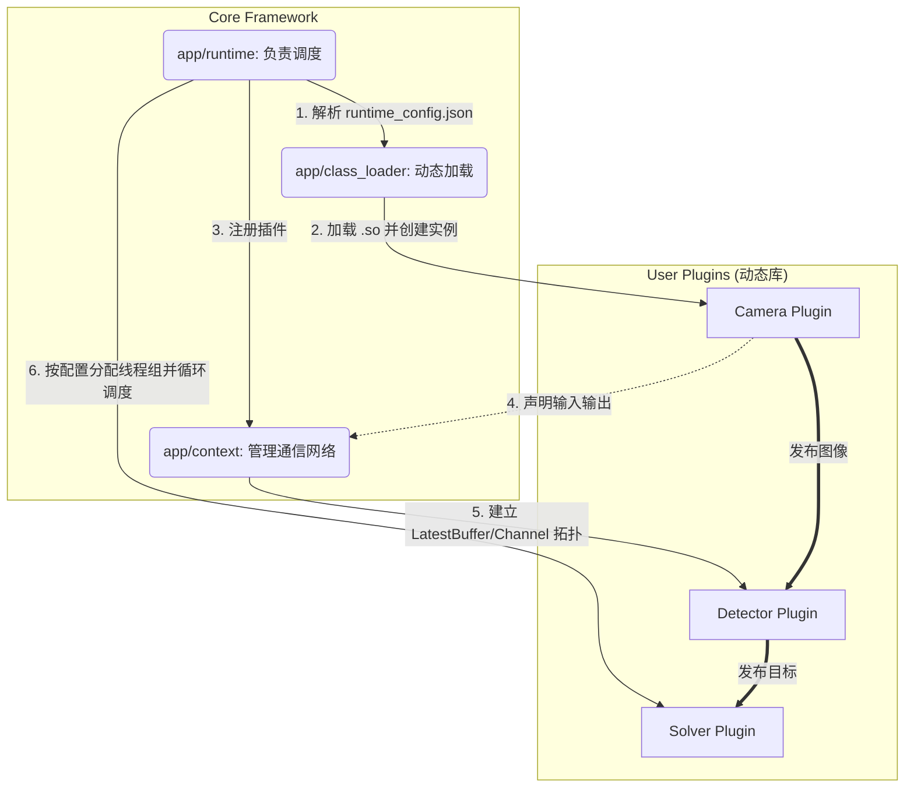

# Auto-aim-Core

`Auto-aim-Core` 是自瞄应用的核心框架子模块。它提供了插件化架构、高性能通信网络、动态库加载、运行时入口，以及各类通用算法和可视化辅助工具。

核心设计目标是**保持高度复用**：将底层通用能力封装在 core 中，而父项目通过 CMake 引入 core，专注于开发具体的业务插件（如检测、解算算法）和组装运行配置。

---

## 1. 架构概览

框架主要由**运行时（Runtime）**、**通信上下文（Context）** 和 **插件模块（Plugins）** 三部分组成：



* **插件化与动态加载**：各业务功能被拆分为独立的插件，编译为单独的动态库（`.so`）。框架在运行时通过 `class_loader` 按需加载。
* **数据驱动与声明式通信**：插件不直接互相调用，而是在初始化时通过 `declare()` 声明自己所需的输入和提供的输出。`Context` 负责校验类型并建立 **仅保留最新数据（Latest-Only）** 的无锁通信通道。
* **灵活的线程调度**：通过配置文件灵活控制插件是运行在独立线程，还是多个插件串行共享一个线程。

---

## 2. 快速上手：编写与运行一个插件

### 2.1 编写插件代码
一个标准的插件需要继承 `app::PluginBase`，重写 `declare()`（声明输入输出）和 `process()`（业务逻辑），最后注册到工厂。

```cpp
#include "app/interface/PluginBase.hpp"
#include "app/class_loader/class_loader.hpp"

class MyDetectorPlugin : public app::PluginBase
{
public:
    void declare(app::Context& ctx) override
    {
        // 声明需要订阅 "image_raw" 话题 (一对一流水线)
        ctx.declare_input_buffer<cv::Mat>(this, "image_raw");
        // 声明将会发布 "targets" 话题
        ctx.declare_output_buffer<std::vector<Target>>(this, "targets");
    }

    void process(app::Context& ctx) override
    {
        // 1. 获取并缓存通信端点
        // 🚨强烈建议使用 static 缓存端点，避免每次调度循环都去 Context 查找的开销，这在 Channel 订阅者上尤为关键。
        static auto image_sub = ctx.get_buffer_subscriber<cv::Mat>(this, "image_raw");
        static auto target_pub = ctx.get_buffer_publisher<std::vector<Target>>(this, "targets");

        // 2. 尝试获取输入数据（非阻塞获取最新数据，拿走即清空）
        auto image_opt = image_sub.try_pop();
        if (!image_opt) return; // 没数据则直接返回，等待下一次调度

        // 3. 执行业务逻辑
        std::vector<Target> result = run_inference(*image_opt);

        // 4. 发布输出
        target_pub.push(std::move(result));
    }
};

// 注册插件，第一参数为类名（与 JSON 中一致），第二参数为实际类型
REGISTER_PLUGIN("MyDetector", MyDetectorPlugin)
```
> 💡**注意：**
> - *`process()` 是一次调度调用，不能在内部写永久阻塞的死循环。完成后应立即返回，由 Runtime 再次调度。*
> - *关于 `Buffer` 和 `Channel` 的区别与进阶组网配置，请深入参阅 [🔌 Context 通信组网指南](app/context/README.md)。*

### 2.2 配置 `runtime_config.json` 运行
编译完成后，在可执行文件同级的上一级目录的 `config/runtime_config.json` 中配置加载项：

```json
{
    "loading_plugin_list": "plugins",
    "plugins": [
        {
            "name": "Camera",
            "library": "libcamera_plugin.so"
        },
        {
            "name": "MyDetector",
            "library": "libmy_detector_plugin.so",
            "AttachTo": "Camera" 
        }
    ]
}
```
* **`loading_plugin_list`**：指定当前需要加载的插件列表的键名（如未配置，默认加载 `"plugins"`）。**这样设计目的是**：允许在同一个配置文件中预设多套不同的插件列表（例如正常运行配置、专门测试某模块的精简配置等），只需修改此键的值即可快速在多套配置间一键切换，免去了大段注释或来回复制粘贴 JSON 的烦恼。
* **`library`**：编译出的插件动态库名称。
* **`AttachTo`（线程组控制）**：
  * **不填**：创建一个独立线程无限循环调用该插件的 `process()`。
  * **填写目标插件名**：当前插件将加入目标插件所在的线程组。在上述示例中，`MyDetector` 会和 `Camera` 在**同一个线程**中串行执行。这不仅免除了跨线程通信开销，更重要的是**彻底消除了这两者之间数据丢失（掉帧）的风险**（前置模块产出一帧，后置模块立刻同步消费一帧）。

---

## 3. 核心模块与子文档索引

Core 内部包含了极其丰富的子模块能力，深入开发前建议查阅对应模块的使用说明：

### 3.1 `app`：框架核心层
* `app/interface`：定义了插件基类 `PluginBase` 和通用数据契约。这里只描述“能力”，不暴露具体实现。
* [**`app/context`**](app/context/README.md)：负责收集插件声明，检查网络拓扑（类型、方向匹配），并分配底层通信工具。
* `app/class_loader`：封装了 `dlopen` 的动态加载机制和工厂注册宏。
* `app/runtime`：主入口，负责读取配置、构建线程组，并执行网络校验和循环调度。

### 3.2 `utility`：基础设施层
* [**`threads`**](utility/threads/README.md)：核心通信基石，提供 `LatestBuffer<T>` 和 `LatestChannel<T>`。*(附：[内部并发模型设计](utility/threads/docs/数据传输模型.md))*
* [**`foxglove_viz`**](utility/foxglove_viz/README.md)：与 Foxglove Studio 无缝对接的 JSON 曲线与 3D 渲染组件。
* [**`time`**](utility/time/README.md)：纳秒级统一时间戳系统与性能帧率统计器。
* [**`transform_tools`**](utility/transform_tools/README.md)：基于 OpenCV、Eigen、Sophus 的强类型三维坐标变换与 TF 树维护工具。
* `config_loader`：JSON 配置文件读取工具。

### 3.3 `algorithm`：通用算法层
* [**`function`**](algorithm/function/README.md)：通用时间、相位与数学辅助函数模块。

*(业务项目应优先通过 CMake target 和公开头文件使用上述能力，切忌直接依赖 core 内部的相对路径和文件布局)*

---

## 4. 父项目集成指南

### 4.1 CMake 引入
父项目只需把本仓库放在 `src/core` 路径下，然后在顶层 `CMakeLists.txt` 中添加一行即可：

```cmake
add_subdirectory(src/core)
```
*注意：父项目不要去直接 add core 内部的子目录（如 `app/utility`），由 core 自己负责内部目录的装载。*

### 4.2 暴露的 CMake Target 清单
引入 core 后，父项目可直接在业务代码中链接以下 Target：

| Target 名称 | 类型 | 用途说明 |
|---|---|---|
| `app_interface_lib` | INTERFACE | 插件接口、通用数据契约（**编写插件必链**） |
| `class_loader_lib` | SHARED | 插件动态加载、注册宏（**编写插件必链**） |
| `threads_lib` | INTERFACE | 线程通信工具 |
| `config_loader_lib` | SHARED | 配置读取 |
| `google_logger_lib` | INTERFACE | Google glog 日志封装 |
| `img_viz_lib` | SHARED | OpenCV 图像可视化 |
| `transform_tools_lib` | SHARED | 坐标变换（依赖 OpenCV, Eigen, Sophus） |
| `foxglove_lib` / `foxglove_viz` | SHARED | Foxglove 调试相关 |
| `foxglove_interface_lib` | INTERFACE | Foxglove 自动生成的 flatbuffers 头文件 |
| `time_lib` | INTERFACE | 统一时间戳类型和时间差计算工具 |
| `function_lib` | SHARED | 可复用算法函数模块 |

### 4.3 编译插件库规则
父项目在编译自己的业务插件时，应始终编译为 `SHARED`（动态库），并链接必需的基础接口库，**切忌将插件库硬链接到最终的 app 可执行文件上**：

```cmake
add_library(detector_plugin SHARED src/DetectorPlugin.cpp)
target_link_libraries(detector_plugin PUBLIC app_interface_lib class_loader_lib)
```

---

## 5. 工程规范与约定

### 5.1 统一输出目录
为了保证 Runtime 能直接通过 JSON 中配置的库名（如 `libdetector_plugin.so`）加载插件，**父项目顶层 CMake 必须统一设置输出目录**，确保主程序和插件库输出到同一路径下：

```cmake
set(PROJECT_OUTPUT_DIR ${CMAKE_SOURCE_DIR}/output)
set(CMAKE_RUNTIME_OUTPUT_DIRECTORY ${PROJECT_OUTPUT_DIR})
set(CMAKE_LIBRARY_OUTPUT_DIRECTORY ${PROJECT_OUTPUT_DIR})
# 建议对所有构建类型 (Debug/Release 等) 做相同的输出路径配置
```

### 5.2 依赖收敛规范
父项目和插件在引入外部庞大库时，应尽量**按需链接组件**，以降低构建与链接开销。
例如：
```cmake
# 推荐做法
find_package(OpenCV REQUIRED COMPONENTS core imgproc)
target_link_libraries(target PRIVATE opencv_core opencv_imgproc)

# 不推荐做法
target_link_libraries(target PRIVATE ${OpenCV_LIBS}) 
```

### 5.3 子模块修改与提交边界
* **属于 Core 的修改**：通信机制升级、基础接口重构、通用数学算法优化等。
* **属于父项目的修改**：具体业务逻辑实现（如全新的装甲板检测逻辑）、`runtime_config.json` 的节点组合调整、顶层 CMake 编译参数调整。
* **提交顺序**：如果修改了 core 的源码，必须**先在 core 仓库内 Commit 并 Push**，然后再回到父项目更新并提交 Git Submodule 的指针。父项目的 Commit 中不应包含任何 core 内部代码的 Diff。
