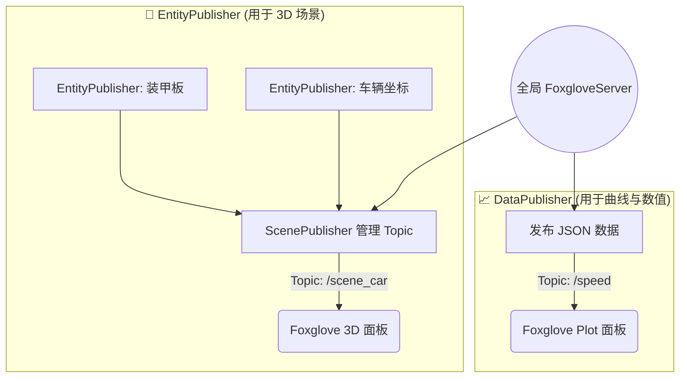

# Foxglove Viz (可视化调试组件)

`foxglove_viz` 提供了一套直接集成到 [Foxglove Studio](https://foxglove.dev/) 的轻量级 C++ 发布接口。你可以用它把算法中的数值变量实时绘制成曲线，或者将目标的三维位姿在 3D 场景中渲染成几何体。

---

## 1. 核心架构与工具选型

所有数据最终都经由全局单例 `FoxgloveServer` 转发至 WebSocket 端口。面对不同的可视化需求，你需要选择不同的 Publisher：



### 选型对照表

| 对比项 | DataPublisher | EntityPublisher |
| --- | --- | --- |
| **主要用途** | 曲线、状态监测、布尔值、数值数组 | 3D 场景中的几何体（装甲板、车体等） |
| **Foxglove 面板** | Plot（曲线图）, Raw Messages 等 | 3D 面板 |
| **底层通道** | `foxglove::RawChannel` (JSON) | `foxglove::schemas::SceneUpdateChannel` |
| **常见接口** | `publish(10.0, true, ...)` | `publish_cubes()`, `publish_spheres()` |

---

## 2. 快速起步

### 2.1 依赖与头文件
在 CMake 中链接 `foxglove_viz_lib`（若已链接 `app_interface_lib` 则无需重复手动链接）。
```cpp
#include "foxglove_viz/foxglove_viz.hpp"
```

### 2.2 获取服务器实例
无论是创建哪种 Publisher，都必须先获取全局唯一的 Server 实例：
```cpp
auto &server = foxglove_viz::global_foxglove_server();
```

---

## 3. 📈 DataPublisher (曲线与数值)

`DataPublisher<Ts...>` 利用 C++ 模板自动推导并生成 Foxglove 兼容的 JSON Schema。

### 3.1 创建与发布

**单字段与多字段**：你可以自定义字段名，方便在 Plot 面板中搜索。
```cpp
class GimbalDebug
{
public:
    GimbalDebug()
    {
        // 创建 Publisher，指定字段名为 yaw 和 pitch
        m_pub = foxglove_viz::global_foxglove_server()
                    .create_publisher<double, double>("/gimbal", {"yaw", "pitch"});
    }

    void update(double yaw, double pitch)
    {
        // 参数类型必须与 <double, double> 严格匹配
        m_pub->publish(yaw, pitch); 
    }
private:
    // Publisher 应当作为长期持有的成员变量！
    foxglove_viz::DataPublisher<double, double>::Ptr m_pub;
};
```

**支持的类型**：
* 标量：`double`, `bool`, `int64_t`, `uint64_t`。（注意：普通的字面量 `3` 是 `int`，需要显式强转或使用后缀 `int64_t{3}`）
* 数组：上述类型的 `std::vector<T>` 或定长 `std::array<T, N>`。

### 3.2 绑定特定时间戳发布
如果你正在做录包回放或预测模块开发，需要把数据时间“拍”到特定的过去或未来：
```cpp
timetool::Timestamp frame_timestamp = timetool::now_timestamp();
m_pub->publish_with_time(frame_timestamp, yaw, pitch);
```

---

## 4. 🧊 EntityPublisher (3D 场景与几何体)

Foxglove 的 3D 面板采用 `Topic -> Frame -> Entity` 的树形结构。为了方便使用，我们通常跳过手建 Scene，直接操作 `EntityPublisher`。

### 4.1 创建实体发布器
```cpp
auto armor_pub = foxglove_viz::global_foxglove_server()
    .create_entity_publisher("/scene_car", "car_frame", "armors_3d");
```
* **Topic (`/scene_car`)**：Foxglove 3D 面板订阅的入口，多个组件可以复用同一个场景。
* **Frame (`car_frame`)**：该实体的局部坐标系参考系。
* **Entity ID (`armors_3d`)**：身份标识。同一 ID 下的数据每次发布都会**覆盖刷新**。如果你想同时显示车轮和装甲板，需要创建两个不同 ID 的 Publisher。

### 4.2 绘制基础几何体

**立方体 (Cube)**
```cpp
foxglove::schemas::CubePrimitive cube;
cube.pose.position = {.x = 1.0, .y = 0.0, .z = 0.5};
cube.pose.orientation = {.x = 0.0, .y = 0.0, .z = 0.0, .w = 1.0}; // 四元数
cube.size = {.x = 0.3, .y = 0.2, .z = 0.1}; // 长宽高
cube.color = {.r = 1.0, .g = 0.0, .b = 0.0, .a = 0.8}; // RGBA [0.0, 1.0]

armor_pub->publish_cubes({cube});
```

**球体 (Sphere)**
*注意：`size` 代表的是整体直径范围，而不是半径。*
```cpp
foxglove::schemas::SpherePrimitive sphere;
// ... 配置 pose 和 color ...
sphere.size = {.x = 0.15, .y = 0.15, .z = 0.15};
armor_pub->publish_spheres({sphere});
```

**箭头 (Arrow)**
默认箭头指向局部坐标系的 `+x` 方向，依靠四元数控制旋转。
```cpp
foxglove::schemas::ArrowPrimitive arrow;
// ... 配置 pose 和 color ...
arrow.shaft_length = 1.0;     // 箭杆长
arrow.shaft_diameter = 0.03;  // 箭杆粗细
arrow.head_length = 0.2;      // 箭头长
arrow.head_diameter = 0.08;   // 箭头粗细
armor_pub->publish_arrows({arrow});
```

### 4.3 清理画面
如果目标已经丢失，为了防止重影，你可以从画面中移除这个几何体：
```cpp
armor_pub->delete_entity(); // 仅删除 armors_3d
```

---

## 5. 🚨 避坑指南

1. **生命周期问题**：千万不要在 `process()` 或 `while` 循环里反复 `create_publisher()`！每次 create 都会向 WebSocket 发送一次底层 topic 注册。请务必将返回的 Publisher 智能指针存为**类的成员变量**。
2. **端口冲突**：不要和旧版 `Visualization` 组件同时启动，它们的 Foxglove 端口会互相占用导致其中一个崩溃。
3. **数据类型严格匹配**：调用 `DataPublisher::publish()` 传参时，哪怕你是传了一个 `float` 给声明为 `<double>` 的模板实例，编译也会报错。必须严格对其类型字面量。
