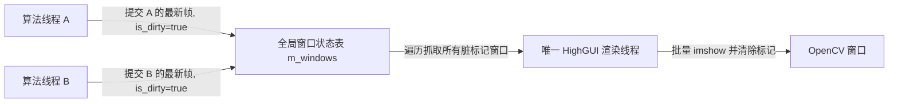

# img_viz（异步图像可视化）

`img_viz` 是一个高性能的 OpenCV HighGUI 图像显示组件。它将所有 `cv::namedWindow`、`cv::imshow` 和 `cv::waitKey` 调用集中到唯一的后台线程，业务线程只负责提交图像，因此无需在各算法模块中重复处理 GUI 线程问题。

模块面向实时调试：同一窗口只保留尚未显示的最新帧，主动丢弃过期画面，避免显示线程跟不上生产速度时积压大量图像。

## 快速开始

在程序最开头（如 `main` 函数中），你**必须**调用 `init` 来决定是否开启图像显示：

```cpp
#include "img_viz.hpp"

int main() 
{
    // 开启图像显示。若传入 false，则全局禁用，此时实现绝对零开销，不会启动后台线程。
    ImgViz::init(true); 

    // ... 启动业务算法线程 ...
}
```

随后在任意算法模块中，只需按窗口名提交图像即可：

```cpp
#include "img_viz.hpp"

void process(const cv::Mat &debug_image)
{
    // 提交后可以立刻修改、复用或释放 debug_image。
    ImgViz::enqueue_image_copy("Detector", debug_image);
}
```

> 💡 **提示**：窗口名是窗口的唯一标识。同名提交会刷新原窗口，不要把帧号或时间戳拼进窗口名，否则会持续创建新窗口导致内存泄漏。

## 集成

在目标的 CMake 配置中链接接口库：

```cmake
target_link_libraries(your_target PRIVATE img_viz_lib)
```

`img_viz_lib` 会传递 OpenCV `core`、`highgui` 和线程库依赖。

## 提交接口详解

### `enqueue_image_copy`（深拷贝）

```cpp
ImgViz::enqueue_image_copy("Detector", image);
```

该接口深拷贝像素数据。它最安全，适用于相机帧缓冲会复用、调用方会继续绘制或修改图像、以及图像生命周期不确定的情形。

### `enqueue_image_zero_copy`（零拷贝）

```cpp
const cv::Mat fixed_debug_image(480, 640, CV_8UC3, cv::Scalar::all(0));
ImgViz::enqueue_image_zero_copy("StaticDebug", fixed_debug_image);
```

该接口只复制 `cv::Mat` 的矩阵头和引用计数，不复制像素数据。它能避免大图像的深拷贝，但调用方必须保证：
- 底层像素内存在显示线程取走图像前不会失效；
- 没有其他线程并发修改这块像素内存；
- 不将相机 SDK 后续会复用的采集缓冲区直接传入。

## 架构与调度原理

内部使用 `std::unordered_map` 来维护各个窗口的状态，并采用“脏标记（Dirty Flag）”模型来进行无锁批量渲染：



每次业务线程调用 `enqueue` 系列方法时，只会覆盖该窗口在表中的图像引用并将 `is_dirty` 标为 `true`。后台显示线程在运行时会短暂获取锁，将所有脏窗口提取到一个本地容器中，然后释放锁并统一进行耗时的 `imshow` 调用。

这种设计彻底抛弃了传统的“图像队列”，带来两大核心优势：
1. **天然防积压**：无论算法线程多频繁地提交画面，都只是原地覆盖最新图像，彻底杜绝了因消费跟不上而导致的队列积压和内存暴涨。
2. **极低的锁竞争**：底层采用现代 C++ 的 `std::atomic` 结合一维状态机管理，禁用模式下完全无锁；显示模式下也仅在交换图像快照的瞬间持有锁。

> ⚠️ **注意**：`cv::waitKey` 强依赖可用的桌面 GUI 环境。无显示器或未配置图形后端（如服务器/工控机部署）的环境，请务必传入 `init(false)` 禁用此组件。

