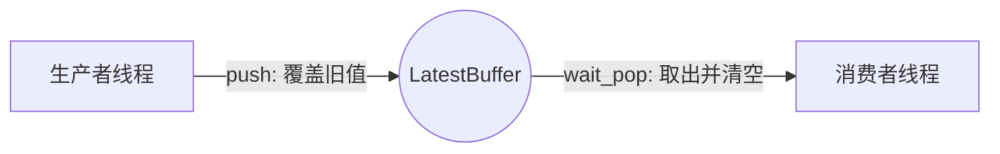
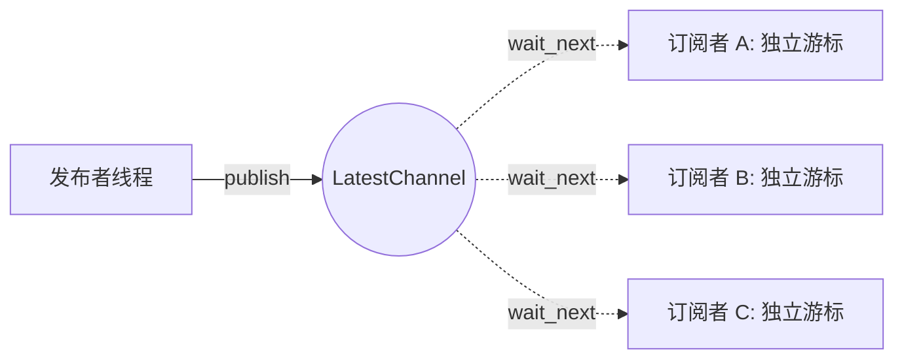

# Threads (线程通信工具)

`threads` 包提供了专为自瞄系统设计的高性能跨线程数据传输工具。
在实时系统中，我们通常**不关心过期的数据**（比如两秒前过期的画面），因此这里提供的工具全部是 **Latest-only（只保留最新数据）** 的通信模型，它绝不是传统的 FIFO 队列。

根据消费者的数量，本包提供了两个核心类：`LatestBuffer<T>` 和 `LatestChannel<T>`。

---

## 1. LatestBuffer：一对一流水线

`LatestBuffer<T>` 是一个容量永远为 1 的槽位。适合像“相机 -> 算法”这样单向流动的数据管道。



* **特性**：消费者取走数据后，Buffer 就会变空。如果消费者处理太慢，生产者的新数据会直接覆盖掉没来得及处理的旧数据。

**使用示例：**
```cpp
#include "threads/latest_buffer.hpp"
#include <thread>
#include <iostream>

threads::LatestBuffer<int> buffer;

void producer()
{
    for (int i = 0; i < 5; ++i)
    {
        buffer.push(i); // 总是放入最新状态
        std::this_thread::sleep_for(std::chrono::milliseconds(10));
    }
}

void consumer()
{
    while (true)
    {
        // 阻塞等待，直到有新数据。取出后 buffer 变空。
        int data = buffer.wait_pop(); 
        std::cout << "处理数据: " << data << std::endl;
    }
}
```

---

## 2. LatestChannel：一对多状态广播

`LatestChannel<T>` 是一个进程内的广播通道。适合像“底盘姿态”这样需要被系统中多个算法模块同时读取的全局状态。



* **特性**：通道里的数据**不会**被某个订阅者吃掉。每个订阅者都有独立的版本号，它们可以反复读取同一份数据。为了避免大对象拷贝开销，通道内传递的是 `std::shared_ptr<const T>`。

**使用示例：**
```cpp
#include "threads/latest_channel.hpp"
#include <thread>
#include <iostream>

threads::LatestChannel<int> channel;

void publisher()
{
    int state = 0;
    while (true)
    {
        // 注意：必须打包成 shared_ptr 发布
        channel.publish(std::make_shared<int>(++state));
        std::this_thread::sleep_for(std::chrono::milliseconds(10));
    }
}

void subscriber_task(int id)
{
    // 1. 创建订阅者（会保存当前的内部版本号状态）
    auto sub = channel.create_subscriber();
    
    while (true)
    {
        // 2. 阻塞等待比自己当前版本更新的数据
        std::shared_ptr<const int> data = sub.wait_next();
        std::cout << "订阅者 " << id << " 收到: " << *data << std::endl;
    }
}
```

---

## 3. 该选哪个？

| 对比维度 | `LatestBuffer<T>` | `LatestChannel<T>` |
|---|---|---|
| **适用场景** | 一对一单播流水线 | 一对多全局状态广播 |
| **取数方式** | `wait_pop()` 取走并清空槽位 | `wait_next()` 仅推进自己的游标，不清空槽位 |
| **数据类型** | 直接传递裸对象 `T` | 必须传递共享指针 `std::shared_ptr<const T>` |

---

## 🚨 致命避坑警告

**绝对不要拿着业务互斥锁去阻塞等待！**
由于这两个工具的 `wait` 系列函数都会阻塞当前所在线程，如果你在持有一把全局业务锁（如 `std::lock_guard`）的同时调用 `wait_pop()` 或 `wait_next()`，而发布线程又需要这把锁才能发布数据，极大概率会造成整个程序死锁。
*正确做法：先裸调用等待函数，收到数据后，再去竞争你的业务锁来更新状态。*

---

> 💡 **深入探索：** 如果你对底层并发模型、为什么 Channel 不维护订阅者列表、或者对死锁安全性论证感兴趣，请阅读本目录下的 [底层架构与传输模型原理](docs/数据传输模型.md)。
