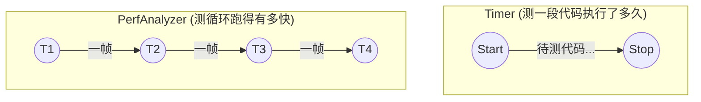

# time (统一时间工具)

`src/core/utility/time` 是一个 **header-only** 库，它提供统一的时间戳类型、时间差计算，以及用于单次耗时测算和周期帧率统计的小型工具类。

---

## 1. 基础类型与工具函数

项目内跨模块传递时间（如 `InputFrame::timestamp`、相机 `host_time`、跟踪器更新时间）时，**必须统一使用 `timetool::Timestamp`**，避免各模块各自选用五花八门的 `chrono` 类型导致类型地狱。

```cpp
#include "time/time.hpp"

// 1. 获取当前系统时间戳
const auto t0 = timetool::now();

// 2. 将统一时间戳转为纳秒 uint64_t（常用于与其它语言/电控协议对接）
const uint64_t ns = timetool::to_epoch_nanoseconds(t0);

// 3. 计算时间差 (前减后)
const auto t1 = timetool::now();
const double ms  = timetool::minus_ms(t1, t0); // 快捷函数：毫秒
const double sec = timetool::minus<std::chrono::seconds>(t1, t0); // 泛型：自定义单位
```

*支持的 `Unit` 模板参数：`nanoseconds`, `microseconds`, `milliseconds`, `seconds`, `minutes`, `hours`。*

---

## 2. 测时工具选型对比

除了基础的加减时间，本库还提供了两种高级的测时工具。请根据你的需求场景进行选择：



---

## 3. Timer：单次区间计时

适用于函数块、算法处理步骤等 **一次 start → stop** 的耗时测量。

```cpp
timetool::Timer timer;

timer.start();
// ... 待测算性能的代码块 ...
timer.stop();

// 将结果直接打印到 std::cout (例如输出: "Timing result: 15 ms")
timer.print<std::chrono::milliseconds>();  
```

### 🚨 状态保护
为防止计时逻辑写错导致荒谬的结果，`Timer` 内部带有状态检查机：
* `start()`：若已经在运行中，抛出异常。
* `stop()`：若未 `start()` 过，抛出异常。
* `print()`：若未 `stop()`，抛出异常。
*(重复测量时，必须重新调用 `start()` 以覆盖上次的记录)*

---

## 4. PerfAnalyzer：周期性帧率统计

`PerfAnalyzer<sample_count>` 在固定长度的环形缓冲中保存最近 N 个时间戳，用于估计 **相邻采样之间的平均间隔**（如相机取流间隔、主循环 tick 耗时等）。

### 4.1 基本用法

```cpp
// 定义一个滑动窗口大小为 30 的统计器
constexpr std::size_t kWindow = 30;
timetool::PerfAnalyzer<kWindow> perf;

while (running)
{
    // 1. 每次循环打一个时间戳 (填入环形缓冲)
    perf.sample(timetool::now());
    
    // ... 执行每帧业务逻辑 ...

    // 2. 尝试打印平均间隔（只有凑满 30 个样本才会触发真实的输出）
    perf.try_print_precise<std::chrono::milliseconds>();
}
```

### 4.2 两种打印估算方式

由于各种系统调度的抖动，连续两帧的时间并不绝对均等，因此提供了两种统计算法：

| 打印方法 | 内部算法 | 适用场景 |
|------|------|----------|
| `try_print_precise` | 对窗口内数据做**最小二乘线性拟合**，斜率即平均间隔 | 间隔有轻微随机抖动，希望过滤毛刺、求得更稳的平均周期 |
| `try_print_rough` | `(首部时间 - 尾部时间) / (N - 1)` | 实现极简、计算开销小 |

> 💡 **关于 FPS（帧率）**：
> `try_print` 系列函数会将结果直接输出至控制台而没有返回值。如果你观察到打印出的平均间隔（例如：`precise average time interval: 33.3 ms`），对应的宏观帧率即为 `FPS ≈ 1000.0 / 33.3 ≈ 30`。

### 4.3 最佳实践
1. **别放在分支里**：必须在稳定的周期路径上调用 `sample`。如果把它包在 `if (has_target)` 里偶发采样，那它算出来的间隔毫无意义。
2. **节流打印**：如果你觉得终端输出太快，可以自行加入一个计数器（如 `if(count++ % 100 == 0)`），避免 `try_print` 疯狂刷屏。
3. **窗口大小的选择 (`sample_count`)**：窗口越大，平均值越平滑，但对系统掉帧等突发状况的响应越迟钝。通常建议取 `10` ～ `60` 之间。

---

## 5. 项目集成与验证

**CMake 链接方法：**
```cmake
target_link_libraries(your_target PRIVATE time_lib)
```
*(注：如果你的 target 已经链接了 `app_interface_lib`，则它已经为你传递了 `time_lib`，无需重复手动链接。)*

