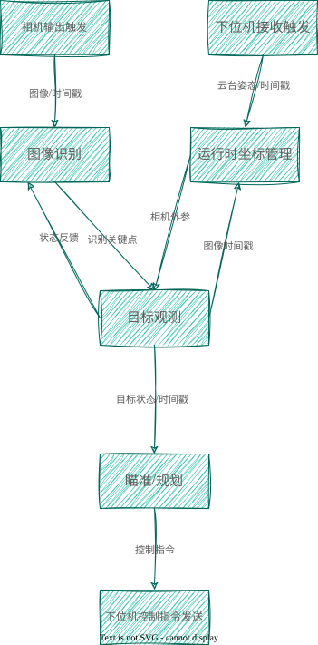
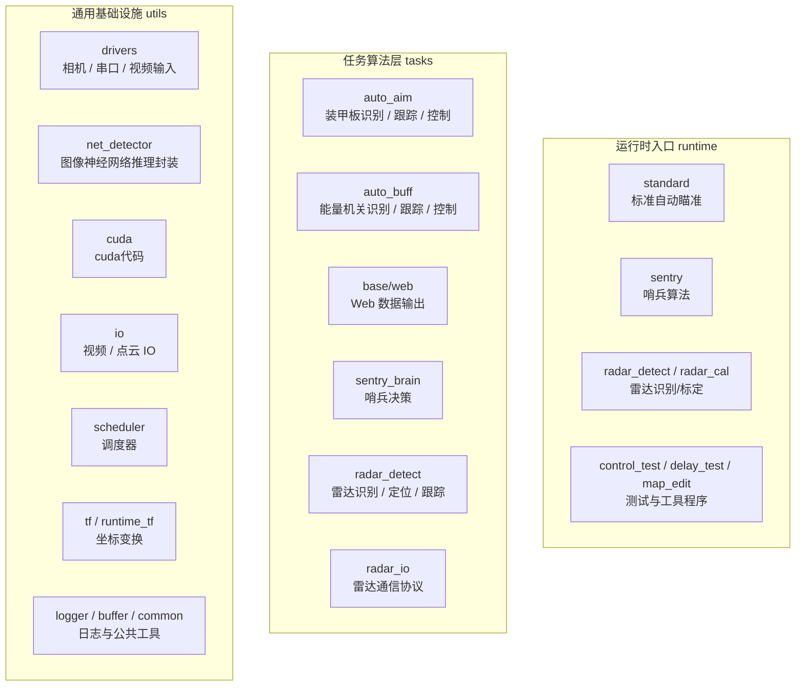

<div align="center">

# AWAKENING

**武汉科技大学 RoboMaster 崇实战队视觉算法代码仓库**

<p>
  
  
  
  
</p>

<p>
  
  
  
</p>

<p>
  
  
  
</p>

</div>

---

<div align="center">

持续开发中，欢迎向我们提供本仓库的错误与问题，欢迎进行技术交流

</div>

---

## 📑 目录

- [AWAKENING](#awakening)
  - [📑 目录](#-目录)
- [✨ 亮点](#-亮点)
- [🚀 运行效果](#-运行效果)
  - [运行时性能](#运行时性能)
  - [效果演示](#效果演示)
- [🛠 部署](#-部署)
  - [📦 依赖](#-依赖)
    - [基础构建环境](#基础构建环境)
    - [推理与设备 SDK](#推理与设备-sdk)
  - [⚡ Quick Start](#-quick-start)
    - [安装 apt 依赖](#安装-apt-依赖)
    - [拉取代码并构建运行](#拉取代码并构建运行)
  - [🌐 启动远程 Web 可视化](#-启动远程-web-可视化)
  - [⚙️ 运行脚本](#️-运行脚本)
- [🔄 数据流图](#-数据流图)
- [🏗️ 软件架构](#️-软件架构)
- [📂 文件结构](#-文件结构)
- [🧩 核心代码结构](#-核心代码结构)
- [🧠 算法详解](#-算法详解)
- [📝 TODO](#-todo)
- [👨‍💻 作者](#-作者)
- [🙏 对本项目有帮助的 RoboMaster 开源项目或者个人](#-对本项目有帮助的-robomaster-开源项目或者个人)
- [📚 前作](#-前作)

---

# ✨ 亮点

- **多任务一体化视觉框架**：覆盖自动瞄准、能量机关、全向感知、哨兵决策、雷达识别等 RoboMaster 视觉任务，算法模块与运行时入口分离，便于在不同兵种、车型和比赛需求间复用和裁剪。

- **高性能低延迟推理链路**：支持 OpenVINO 与 TensorRT/CUDA 后端，并针对多线程推理链路进行优化。

- **完整的部署与调试工具链**：支持 SSH + Web 远程控制与可视化，只需一根网线即可完成调试，无需桌面环境，减少无关图形界面对计算资源的占用。

---

# 🚀 运行效果

## 运行时性能

以 auto_aim 链路为例，统计范围为从获取图像到该帧完成识别与状态估计，神经网络模型使用 `model/opt-1208-001.onnx`。

| 硬件设备 | 最大吞吐量 | 平均端到端处理时间 |
| :--- | :---: | :---: |
| Intel NUC 1240P + Hik CS016-10UC | 250Hz（受相机帧率限制） | 6-8ms |
| NVIDIA Orin NX 8G + Hik CS016-10UC | 250Hz（受相机帧率限制） | 2-6ms |

---

## 效果演示

https://github.com/user-attachments/assets/96dacb29-bae6-425c-b271-9202b91a749c

# 🛠 部署

## 📦 依赖

### 基础构建环境

- C++23 编译器
- CMake
- Ninja
- OpenCV
- fmt
- Ceres
- Eigen3
- nlohmann-json
- yaml-cpp
- spdlog
- TBB
- Boost

### 推理与设备 SDK

- [OpenVINO](https://flowus.cn/7a2a3341-74a1-4db9-bced-99fe5d05ab75) 2024.0.0+ / [TensorRT-CUDA](https://flowus.cn/e98af178-de0b-4546-808d-a6f1ff199d62)（TensorRT 10.6.0.26，CUDA 12.6）
- HikSDK / MvSDK / DaHengSDK（按实际相机型号选择安装）
- ROS2（可选，用于 ROS2 通信与可视化）

---

## ⚡ Quick Start

### 安装 apt 依赖

```bash
sudo apt update

sudo apt install -y \
    clang \
    cmake \
    ninja-build \
    libopencv-dev \
    libfmt-dev \
    libceres-dev \
    libeigen3-dev \
    nlohmann-json3-dev \
    libyaml-cpp-dev \
    libspdlog-dev \
    libtbb-dev \
    libboost-all-dev
```

### 拉取代码并构建运行

```bash
git clone --recurse-submodules https://github.com/WUST-RM/awakening.git

cd awakening

sudo ./run.sh build

sudo ./run.sh run standard omni true
```

---

## 🌐 启动远程 Web 可视化

```bash
python3 web.py
```

雷达识别链路暂不适用 Web 可视化。

---

## ⚙️ 运行脚本

`run.sh` 支持以下命令：

```bash
sudo ./run.sh build                  # 配置并增量构建

sudo ./run.sh rebuild                 # 删除 build 后全量重构

sudo ./run.sh run <program> [args]    # 构建后运行

sudo ./run.sh race <program> [args]   # 不构建，直接运行 bin 下程序

sudo ./run.sh debug <program> [args]  # 构建后使用 gdb 启动
```

---

# 🔄 数据流图



# 🏗️ 软件架构



---

# 📂 文件结构

```text
.
├── 3rdparty/             # 第三方依赖库
├── auto_start/           # 自启动脚本
├── cmake/                # 第三方 SDK 的 CMake 查找脚本
├── config/               # 运行配置
├── docs/                 # 技术文档与算法说明
├── model/                # 神经网络模型文件
├── script/               # 辅助脚本
├── src/                  # C++ 主代码
├── static/               # Web 可视化静态资源
├── templates/            # Web 可视化页面模板
├── CMakeLists.txt        # CMake 构建入口
├── run.sh                # 构建、运行、调试脚本
└── web.py                # 远程 Web 可视化服务
```

---

# 🧩 核心代码结构

```text
src/
├── runtime/              # 各运行时入口
├── tasks/                # 任务算法模块
│   ├── auto_aim/         # 自动瞄准：识别、跟踪、控制
│   ├── auto_buff/        # 能量机关：识别、跟踪、控制
│   ├── base/             # 弹道、通信包、Web 数据等公共任务组件
│   ├── eyes_of_blind/    # 图传编码/解码链路
│   ├── radar_detect/     # 雷达识别、定位、跟踪与地图匹配
│   ├── radar_io/         # 雷达通信协议
│   └── sentry_brain/     # 哨兵决策逻辑
│
├── utils/                # 通用工具库
│   ├── cuda/             # CUDA 图像预处理
│   ├── drivers/          # 工业相机、UVC、串口、视频输入
│   ├── io/               # 视频、点云等数据 IO
│   ├── net_detector/     # 图像神经网络推理封装
│   └── scheduler/        # 调度器
│
├── _rcl/                 # ROS2 节点与可视化消息
├── _rerun/               # Rerun 可视化
└── pch.hpp               # 预编译头
```

---


# 🧠 算法详解

| 主题 | 文档 |
| :--- | :--- |
| “整车”状态估计 | [docs/algorithm/estimation.md](docs/algorithm/estimation.md) |
| 轨迹优化 | [docs/algorithm/traj_opt.md](docs/algorithm/traj_opt.md) |
| 图像识别 | [docs/algorithm/detect.md](docs/algorithm/detect.md) |
| 并发推理 | [docs/algorithm/concurrent_inference.md](docs/algorithm/concurrent_inference.md) |

---

# 📝 TODO

- [ ] 针对现实装甲板特征可见性的投影模型
- [ ] 神经网络识别单独灯条
- [ ] 针对 imu 图像时间对齐的延迟估计

---

# 👨‍💻 作者

- 刘璧洁 [MoCI-L](https://github.com/MoCI-L)  
  雷达识别/通信部分开发与维护

- 岳长鑫 [TRIAuAuAu](https://github.com/TRIAuAuAu)  
  英雄图传

- 武晓健 [hyheiyue](https://github.com/hyheiyue)  
  qq:1836871898  
  vx:hy_xiaojian  

  自动瞄准/能量机关/哨兵决策/雷达识别

---

# 🙏 对本项目有帮助的 RoboMaster 开源项目或者个人

排名不分先后。

- 华南师范大学 PIONEER 战队 @chenjunnn  
  [rm_vision](https://github.com/chenjunnn/rm_vision)

- 中南大学 FYT 战队  
  [FYT2024_vision](https://github.com/CSU-FYT-Vision/FYT2024_vision)

- 河北科技大学 Actor&Thinker 战队  

  [at_vision](https://github.com/PraySky1337/at_vision)

  [Daedalus](https://github.com/Blackjack200/bevy_robomaster_simulator)

  [talos_2026](https://github.com/Blackjack200/talos_2026)

- 同济大学 superpower 战队  

  [sp_vision_25](https://github.com/TongjiSuperPower/sp_vision_25)

- 深圳北理莫斯科大学北极熊战队  

  [armor_detector_tensorrt](https://github.com/SMBU-PolarBear-Robotics-Team/armor_detector_tensorrt)

- 四川大学火锅战队  

  [openvino_armor_detector](https://github.com/Ericsii/rm_vision/tree/develop/openvino_armor_detector)

- 沈阳航空航天大学 TUP 战队  

  [opt-1208-001.onnx](https://github.com/tup-robomaster/TUP-Vision-2023-Based/blob/main/src/vehicle_system/autoaim/armor_detector/model/opt-1208-001.onnx)

- 北京科技大学 Reborn 战队  

  [number_classifier.onnx](https://github.com/RebornVision/Reborn-Vision-2024-armor-Inference/blob/main/model/number_classifier.onnx)

- 常州大学 Climber 战队  

  [Climber_Vision_26](https://github.com/CCZU-Climber/Climber_Vision_26)

- 华北理工大学 Horizon 战队  

  https://github.com/BreCaspian/ROBOMASTER-HORIZON-LiDAR-2025/releases/tag/2026.04.24

- 香港科技大学 ENTERPRIZE 战队  

  [RM2025-Radar-Algorithm](https://github.com/hkustenterprize/RM2025-Radar-Algorithm)

- 南京理工大学 Alliance 战队  

  https://github.com/Alliance-Algorithm

- 五大湖联合大学 The Great Lakes 战队  

  [Pacific_doorlock_sniper](https://github.com/wele0612/Pacific_doorlock_sniper)

- 深圳大学 RobotPilots 战队  

  [RobotDetectionModel](https://github.com/broalantaps/RobotDetectionModel)

- 华中科技大学狼牙战队  

  [HUST_HeroAim_2024](https://github.com/HUSTLYRM/HUST_HeroAim_2024)

- 吉林大学 TARS Go 战队  

  [jlu_vision_26](https://github.com/Fskaaaaaaaa/jlu_vision_26)

- 华南理工大学华南虎战队  

  [rm_vision_core](https://github.com/scutrobotlab/rm_vision_core)

  [rmvl](https://github.com/cv-rmvl/rmvl)

- 哈尔滨工业大学（深圳）南工骁鹰战队  

  [radar_ros_ws](https://github.com/PageChen04/radar_ros_ws)
- 东北大学 TDT 战队  

  [T-DT-2024-Radar](https://github.com/T-DT-Algorithm-2024/T-DT-2024-Radar)

  [T-DT_Radar](https://github.com/T-DT-Algorithm-2025/T-DT_Radar)

- 福建理工大学仓侠战队  

  [PowerRuneSimulator](https://github.com/iowqi/PowerRuneSimulator)

- 上海交通大学交龙战队  

  [adaptive_ekf.hpp](https://github.com/julyfun/rm.cv.fans/blob/main/aimer/base/math/filter/adaptive_ekf.hpp)

- 武汉工程大学 Nautilus 战队  
  费钰涵

- 江苏开放大学开拓者战队  
  刘俊豪

- 江苏大学 Aurora 战队  
  聂政华


---

# 📚 前作

[wust_vision](https://github.com/WUST-RM/wust_vision)
